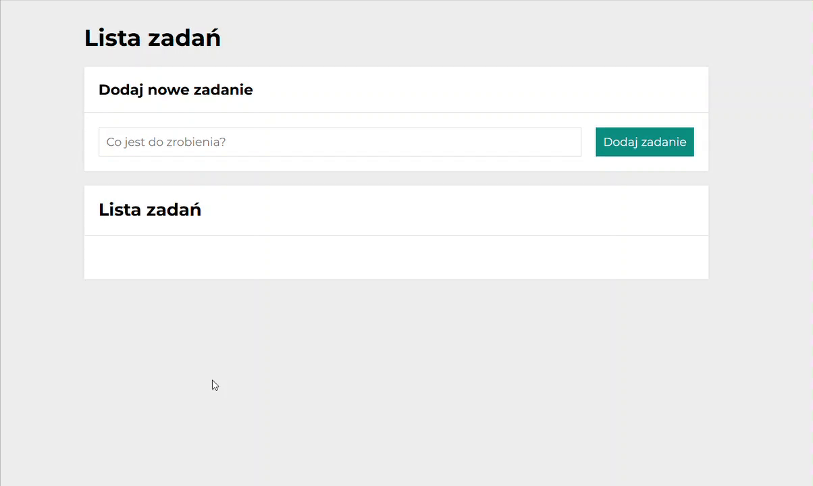

# Aleksandra Jurkiewicz - to do list in React

## Simple to do list. 
### Instruction
1. Type new task content :)
2. Click on button "Dodaj zadanie".
3. Click on green button, if task is done. 
4. Click on red button, if you want to delete task.
5. Click on "Ukończ wszystkie", if all tasks are done.
6. Click on "Ukryj ukończone", if you want to hide done tasks.
7. Click on "Pokaż ukończone", if you want to see them again.

### Used technologies
- JavaScript
- CSS
- HTML
- BEM
- React

